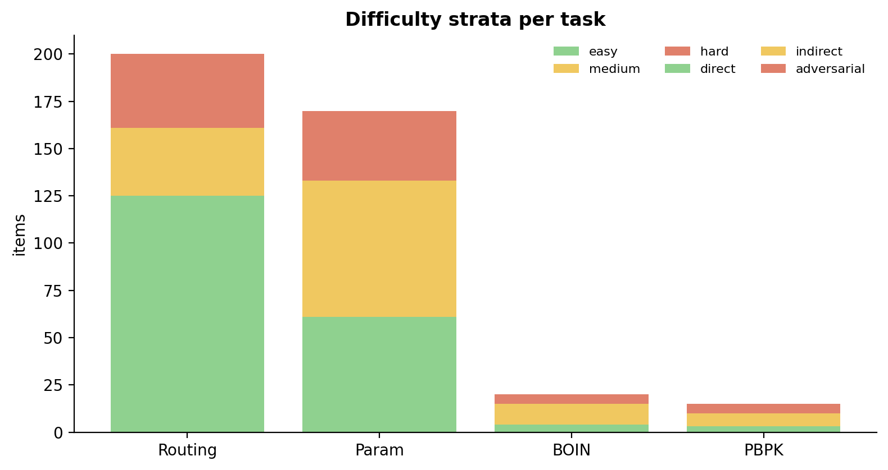
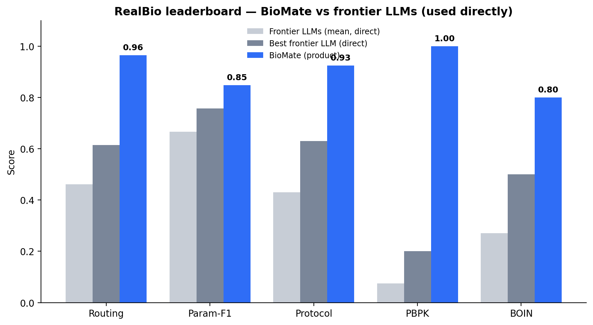

# RealBio — an open, objectively-scored benchmark for bioinformatics AI agents

**Can it run science, not just discuss it?** RealBio tests **real-world execution** — whether an agent can actually route, parameterize, quality-control, and dose real bioinformatics pipelines. **505 items across 5 tasks**, each with **objective ground truth**, graded by **one shared open scorer** (`src/score.py`, no LLM judge). Same items, same metric, for every system — reproducible and comparable, not self-reported.

[](https://creativecommons.org/licenses/by/4.0/)

**🌐 Project:** [biomate.ai](https://biomate.ai) · **🏆 Leaderboard:** [biomate.ai/realbio.html](https://biomate.ai/realbio.html) · **📄 Datasheet:** [`DATASHEET.md`](DATASHEET.md)

> **Growing benchmark.** Three further tasks (execution auto-repair, workflow generation, drug-discovery ligand ranking) are validated and re-added as every system — including BioMate — is measured on the same items with the same metric. We report a task only when the whole board is measured on it.

## Why RealBio exists

Most agentic-bio benchmarks are scored by each system's **own judge on its own private task set** — you can't compare across systems, and it invites (often unintentional) self-grading. RealBio inverts that: **fixed public items, published ground truth, one open deterministic scorer** that anyone runs identically on any system.

## Repository layout

```
├── <task>/data.jsonl        # 5 task datasets (public ground truth) + per-task README
├── results/<system>/*.jsonl # committed predictions per system (re-scorable)
├── src/                     # score.py (the scorer) + run/aggregation harness
├── figures/                 # leaderboard + difficulty figures
├── leaderboard.csv / .md    # the committed leaderboard (regenerates from results/)
└── DATASHEET.md             # dataset documentation (motivation, construction, limitations)
```

## The 5 tasks

| Task | Items | What it tests | Ground truth | Metric |
|---|---:|---|---|---|
| `cross_domain_routing` | 200 | route a natural-language request to the correct **workflow** | `correct_workflow` (+`acceptable_alts`) | exact-match |
| `param_prefill` | 170 | extract parameters from context; don't over-fill | `expected_params` + `must_not_fill` | param-F1 |
| `protocol_thresholds` | 100 | is a sample valid; PASS/FAIL vs a naive universal threshold | `ground_truth` + `expected_correct_action` | action accuracy |
| `boin_benchmark` | 20 | correct BOIN dose-escalation decision | `reference.true_MTD_mg` | exact-MTD |
| `pbpk_benchmark` | 15 | predict PK from SMILES + dose + route | `reference` (Cmax) | within-2-fold |

Items are **original tasks authored from public sources** (nf-core catalog, GEO/PRIDE/EMDB accessions, published PK, BOIN references) — not drawn from any system's training set. Full per-task **construction methodology** is in the [`DATASHEET.md`](DATASHEET.md).


*Figure 1. Deliberate difficulty design — routing spans direct/indirect/adversarial; others grade easy/medium/hard by inference depth.*

## Results

Every cell re-scores from committed `predictions.jsonl` via `src/score.py`. LLMs are evaluated **the way they are actually used** — model + task, no candidate list injected.


*Figure 2. BioMate (product) vs frontier LLMs used directly.*

| System | Routing | Param (F1) | Protocol | PBPK (2×) | BOIN |
|---|---|---|---|---|---|
| **BioMate** (product) | **0.965** | **0.848** | **0.925** | **1.00** | **0.80** |
| Claude Opus 5 | 0.615 | **0.757** | 0.330 | 0.133 | 0.400 |
| Gemini 3.1 Pro | 0.580 | 0.693 | **0.630** | 0.000 | 0.278 |
| GPT-5.6 | 0.530 | 0.671 | 0.460 | **0.200** | **0.500** |
| Kimi K3 | 0.450 | 0.628 | 0.360 | 0.000 | 0.167 |
| DeepSeek V4 | 0.415 | 0.621 | 0.420 | 0.067 | 0.167 |
| GLM-5.2 | 0.400 | 0.641 | 0.440 | 0.000 | 0.111 |
| GPT-5.6-luna | 0.355 | 0.624 | 0.340 | 0.200 | 0.389 |
| Qwen3.8-Max | 0.345 | 0.692 | 0.460 | 0.000 | 0.111 |
| Biomni (Stanford A1) | 0.950 | 0.708 | 0.500 | 0.000 | 0.500 |

Every cell is a same-item, same-scorer result that re-scores from the committed prediction files under `results/`.

### Efficiency & engine (measured, same protocol)

Accuracy is only half the deployment question — the harness also logs **latency** and **generation cost** per item. The cost *unit* differs by harness (the direct-LLM runs logged output tokens; the Biomni agent logged dollar cost; BioMate's product-side token cost is not instrumented in this harness), so each cell states what was actually measured rather than forcing a false common unit.

| System | Routing latency (median) | Generation cost / item (measured) | Engine |
|---|---:|---:|---|
| **BioMate** (product) | **2.3 s** | not instrumented here | Mixture of LLMs — **primary:** Claude Sonnet 4.5; **secondary:** Claude Haiku 4.5, Gemini 3.5 Flash, Gemini 3.1 Pro |
| Claude Opus 5 | 2.7 s | 335 tok | Anthropic Claude Opus 5 |
| Gemini 3.1 Pro | 3.6 s | 1184 tok | Google Gemini 3.1 Pro |
| GPT-5.6 | — | 483 tok | OpenAI GPT-5.6 |
| GPT-5.6-luna | 1.6 s | 727 tok | OpenAI GPT-5.6-luna |
| Kimi K3 | 3.2 s | 1272 tok | Moonshot Kimi K3 |
| DeepSeek V4 | 3.8 s | 1190 tok | DeepSeek V4 |
| GLM-5.2 | 0.8 s | 1147 tok | Z.ai GLM-5.2 |
| Qwen3.8-Max | 4.0 s | 1326 tok | Alibaba Qwen3.8-Max |
| Biomni (A1) | 3.9 s | $0.41–0.77 (agent) | Agent scaffold — **Claude Opus 5** on routing/param/protocol; **Claude Sonnet 4.5** on PBPK/BOIN (Opus-5's API rejects Biomni's assistant-prefill agent loop, removed across Claude ≥ 4.6) |

Latency is wall-clock median over the same items (BioMate measured over the network to its hosted product; GPT-5.6's routing-latency cell is `—` because that run logged latency only on a subset). LLM cost is mean output tokens/item — dollar cost is tokens × the model's price. Biomni's cost is its logged **$/item** on the two agentic tasks it completed (PBPK $0.41, drug-discovery $0.77), reflecting an agent that makes many tool/LLM calls per item.

## Participating systems

Every system was run on the **same fixed items** and scored by the **same** `src/score.py`. Frontier and open-weight LLMs were run the way they are actually deployed (model + task); BioMate was run as the product; Biomni is run as its published agent scaffold.

| System | Organization | Link | Reference |
|---|---|---|---|
| **BioMate** (product) | BioMate AI | [biomate.ai](https://biomate.ai) · [leaderboard](https://biomate.ai/realbio.html) | This benchmark — see [Citation](#citation) |
| Claude Opus 5 | Anthropic | [anthropic.com/claude](https://www.anthropic.com/claude) | — |
| Gemini 3.1 Pro | Google DeepMind | [deepmind.google/models/gemini](https://deepmind.google/models/gemini/) | — |
| GPT-5.6 · GPT-5.6-luna | OpenAI | [openai.com](https://openai.com/) | — |
| Kimi K3 | Moonshot AI | [moonshot.ai](https://www.moonshot.ai/) | — |
| DeepSeek V4 | DeepSeek | [deepseek.com](https://www.deepseek.com/) | — |
| GLM-5.2 | Z.ai (Zhipu AI) | [z.ai](https://z.ai/) | — |
| Qwen3.8-Max | Alibaba Qwen | [qwen.ai](https://qwen.ai/) | — |
| Biomni (A1) | Stanford (Zou Lab) | [biomni.stanford.edu](https://biomni.stanford.edu/) | Huang et al., *Science* 2025, [doi:10.1126/science.adz4351](https://doi.org/10.1126/science.adz4351) |

## Key takeaways for the community

1. **BioMate leads every task on the board.** Routing **0.965**, parameter-F1 **0.848**, protocol-QC **0.925**, PBPK **1.00**, BOIN **0.80** — first on all five. The nearest competitor differs by task (Biomni ties routing at 0.950; Claude Opus 5 is second on param-F1 at 0.757; Gemini 3.1 Pro is second on protocol at 0.630), so no *single* LLM is BioMate's runner-up — the lead is broad, not a one-task artifact.
2. **LLMs used directly fail *execution*, not knowledge.** They are near-useless at PBPK simulation (mean 0.08 within-2-fold) and mediocre at deterministic BOIN dose-finding (mean 0.24) — the computation/execution tasks — while being competent at knowledge-driven extraction.
3. **Output discipline is a real deployment gap.** Several open-weight models emit long reasoning with *no parseable answer* on PBPK/BOIN — which fails deployment even when the reasoning is sound.
4. **The lead is verifiable, not self-reported.** Open fixed items + one shared deterministic scorer + no LLM judge means you *cannot* self-grade — any team runs its own system and lands directly comparable to the numbers above.
5. **On curated routing, a good catalog beats raw model scale.** The largest cross-system spread is routing: BioMate's product (**0.965**) vs the same frontier LLMs used directly (0.345–0.615).

## Run your own system

```bash
# produce predictions.jsonl per task — {"id": ..., "prediction": <answer>} — then:
python3 src/score.py cross_domain_routing my_system/cross_domain_routing.jsonl
# → objective metric + 95% CI, no LLM judge. Directly comparable to the leaderboard.
```

## Citation

```bibtex
@misc{realbio2026,
  title  = {RealBio: an open, objectively-scored benchmark for bioinformatics AI agents},
  author = {Zhang, Yaoyun and Dike, Andrew},
  year   = {2026},
  note   = {BioMate AI},
  url    = {https://biomate.ai/realbio.html}
}
```

## Ground-truth sources (external references)
- **BOIN** — Liu & Yuan, *JRSS-C* 2015, [doi:10.1111/rssc.12089](https://doi.org/10.1111/rssc.12089); Yuan et al., *Clin. Cancer Res.* 2016.
- **PBPK** — FDA drug labels; DrugBank (Wishart et al., *NAR* 2006, [doi:10.1093/nar/gkj067](https://doi.org/10.1093/nar/gkj067)); Rodgers & Rowland, *J. Pharm. Sci.* 2007.
- **Routing** — nf-core (Ewels et al., *Nat. Biotechnol.* 2020, [doi:10.1038/s41587-020-0439-x](https://doi.org/10.1038/s41587-020-0439-x)).
- **Baseline agent** — Biomni (Huang et al., *Science* 2025, [doi:10.1126/science.adz4351](https://doi.org/10.1126/science.adz4351)).

## License
**CC-BY-4.0** — data, ground truth, scorer, and harness. See [`LICENSE`](LICENSE).

---
Built by **[BioMate AI](https://biomate.ai)** · leaderboard: **[biomate.ai/realbio.html](https://biomate.ai/realbio.html)**
